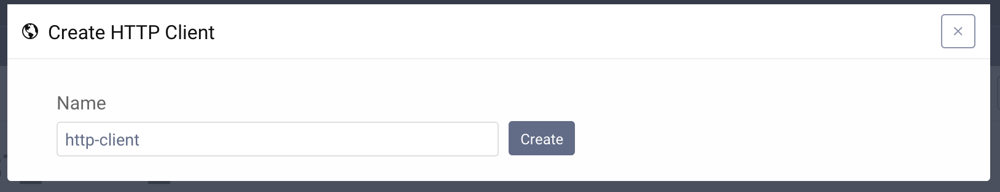
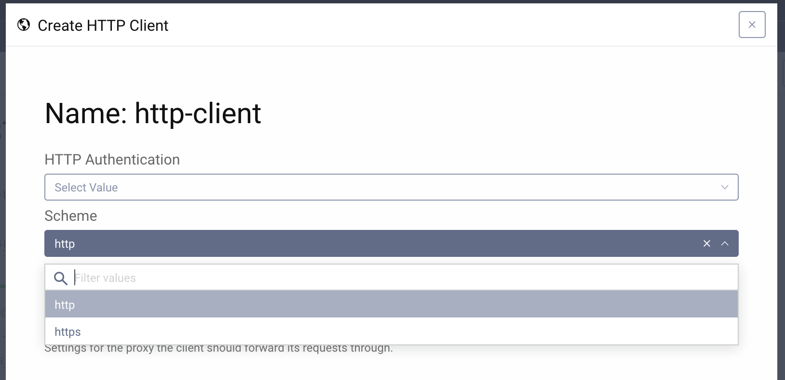
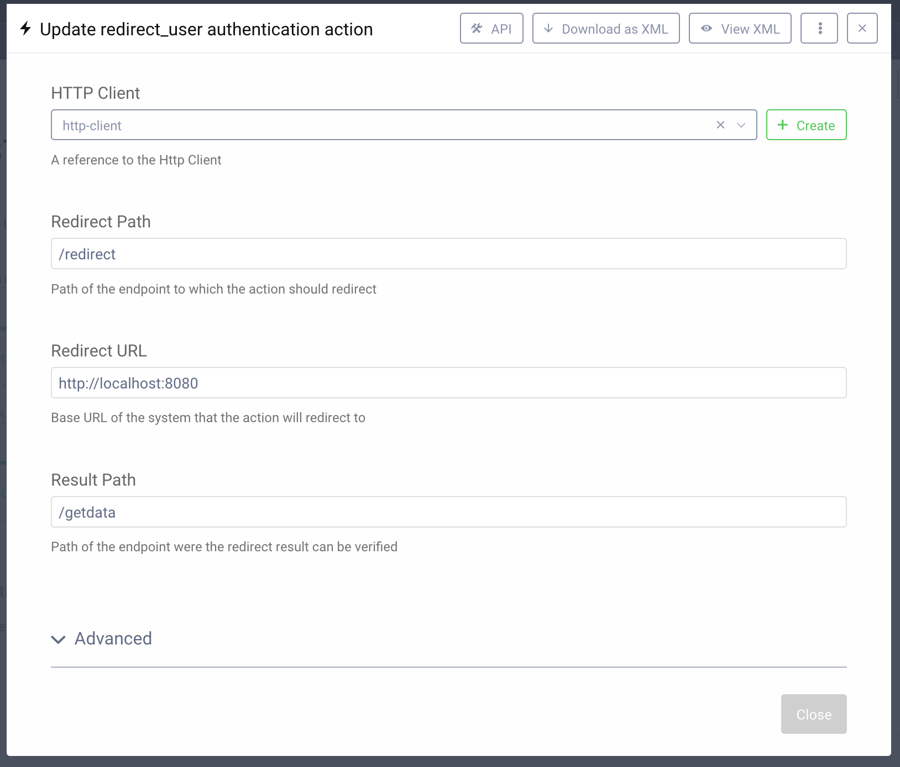

# Redirect Action Example

This repository is an example of an Authentication Action Plugin for the
Curity Identity Server, which uses the `redirect()` response type. It consists
of two parts: 

- the plugin code is in the `identityserver.plugins.authenticationactions.redirect-action`
  directory
- `example` directory which contains a simple demo website to which the
  plugin action redirects. The demo is written in Java and Spring. 

## Running the example

To run the example follow these steps:

- Start the project by running the command `./gradlew bootRun` from the `example`
  directory.
- Install the authentication plugin. Refer to the [plugin's README](identityserver.plugins.authenticationactions.redirect-action/README.rst)
  to check how to do it.
- When the plugin is installed go to the admin UI, then **Authentication Profile** -> **Authenticators**.
  Edit an authenticator of your choice.
- If you want to run the example with a local instance of the Spring application you'll need an HTTP client which uses
  the `http` scheme. To add such client click the `Facilities` button in the top right corner of the screen, scroll down
  to **Http clients** and click the `New` button.
- Enter a suitable name for the client and click `Create`.

- Select the `http` scheme for the client and close the popup.

- Back in the authenticator form, in the action column click the `Add` button in either Login or SSO flow.
- Click `New Action`, enter a suitable name and select `Redirect Action` type.
- Enter the required configuration.

Enter the values from the above screen to run this example.

- Commit your changes. The action plugin is now ready. 

Please visit [curity.io](https://curity.io/) for more information about the Curity Identity Server.
